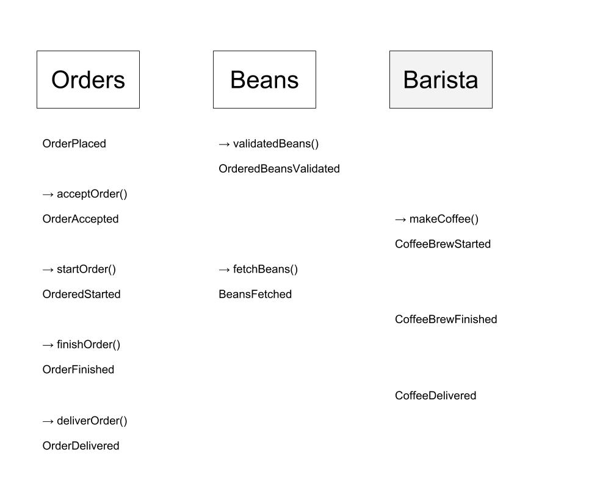

# event-driven-coffee-shop
This project is inspired by Sebastian Daschner's [video](https://www.youtube.com/watch?v=glfpfoPBVCI)

The Goal of this repo is to implement a coffee shop using a Event Driven architecture.

To do so, we will use the following picture of the nominal case of the system.
